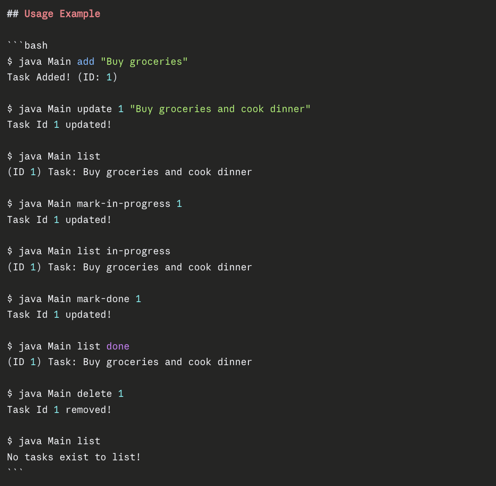

# Task Tracker CLI

A simple command-line task management application built in java. 

## Features
- Add, update, and delete tasks
- Mark tasks as in-progress or done
- List all tasks or filter by status
- Tasks persist in a JSON file

## Usage


## Getting started 

### Compile
```bash
javac *.java
```

### Run
```bash
java Main <command> <args>
```

### Commands

- `java Main add "Buy groceries"` - Add a new task
- `java Main update 1 "New description"` - Update task by ID
- `java Main delete 1` - Delete task by ID
- `java Main list` - List all tasks
- `java Main list todo` - List all tasks with status todo
- `java Main list in-progress` - List all tasks with status in-progress
- `java Main list done` - List completed tasks
- `java Main mark-in-progress 1` - Mark task as in-progress
- `java Main mark-done 1` - Mark task as done
